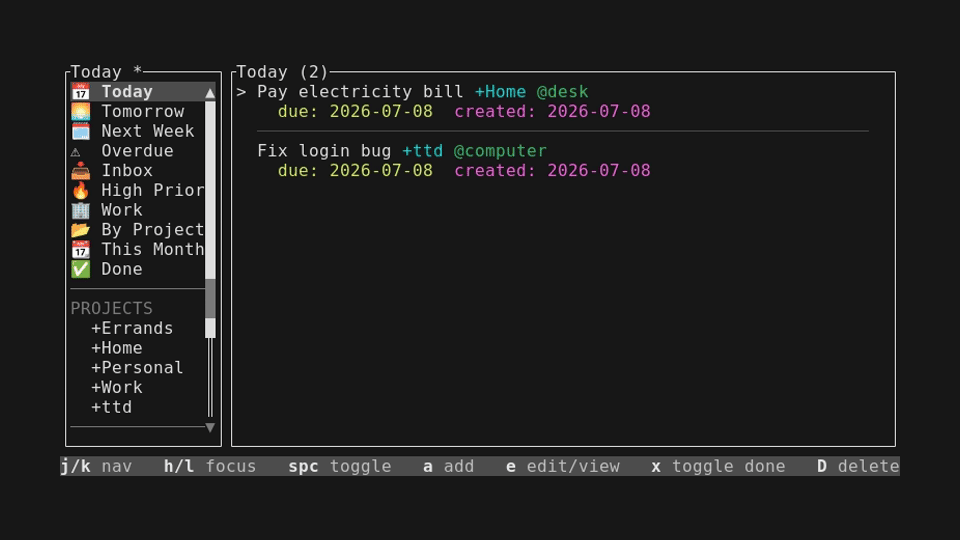
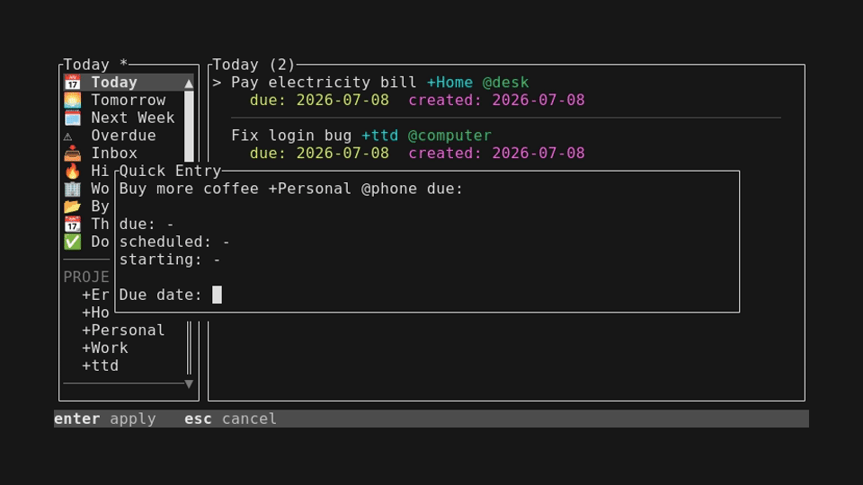

# ttd

`ttd` is a terminal-first task manager for the `todo.txt.d` format.

It stores tasks as plain text, keeps open and completed items in a
`todo.txt.d` style directory layout, and provides both a CLI and a full TUI.

**Spec:** [v3.0.0](https://github.com/esatbayhan/ttd-spec/releases/tag/v3.0.0)

## Features

- **Plain-text storage**: one task per `.txt` file in a directory
- **TUI with smart filters**: Inbox, Today, Scheduled, Upcoming, Done
- **Project and context grouping**: sidebar navigation by `+Project` and `@Context`
- **Inline editing**: quick-add and edit tasks with date shortcut helpers
- **Conflict detection**: safe concurrent editing with advisory file locking
- **Live refresh**: automatic filesystem polling detects external changes
- **CLI commands**: `add`, `list`, `done`, `search` for scripting and quick use
- **Temporary sort and group**: overlay pickers to sort/group by any field without editing list files
- **Vim-style navigation**: `j`/`k`, `h`/`l`, `gg`/`G` keybindings

## Screenshots





## Build and install

Requirements:
- Rust 1.85 or later

Build a release binary:

```bash
cargo build --release
```

The compiled binary will be available at:

```text
target/release/ttd
```

Install it into your Cargo bin directory:

```bash
cargo install --path .
```

## Task directory layout

`ttd` manages a plain-text task directory with this structure:

```text
todo.txt.d/
  done.txt.d/
  lists.d/
    today.list
    inbox.list
    ...
  task-....txt
```

Open tasks live in the root task directory as `.txt` files.
Completed tasks live in `done.txt.d/`.
Smart list definitions live in `lists.d/`.

## First run

Running `ttd` without a subcommand enters the TUI.

On first launch, if no configured task directory exists, the app shows a
welcome screen where you enter the path to your task directory. Once
configured, it enters the main screen.

Config is stored at:
- `$XDG_CONFIG_HOME/ttd/config.conf`
- or `~/.config/ttd/config.conf`

Settings are `key=value` pairs:

| Key | Default | Description |
|-----|---------|-------------|
| `task_dir` | *(required)* | Path to your todo.txt.d directory |
| `editor` | env fallback | Command to open smart list files externally |
| `sidebar_width` | `20` | Sidebar width as a percentage of terminal columns |
| `sidebar_min_width` | `0` | Minimum sidebar width (percentage) |
| `sidebar_max_width` | `50` | Maximum sidebar width (percentage) |
| `show_help_bar` | `true` | Whether the bottom hint panel is visible on startup |
| `auto_update_on_edit` | `false` | Set `updated:YYYY-MM-DD` automatically when editing a task |

## Smart lists

The sidebar in the TUI is populated from `.list` files in the `lists.d/`
subdirectory of your task directory. Each file defines a filtered view
with optional sorting and grouping.

Example (`lists.d/today.list`):

```
---
name: Today
icon: 📅
order: 1
---
due <= today
OR
scheduled <= today

sort by priority desc
sort by due asc
```

Smart lists support date comparisons, priority filters, text matching,
and existence checks. For the full syntax and all available options, see
the [Smart Lists Specification](FORMAT.md).

In addition to smart lists, the sidebar automatically shows `+Project`
and `@Context` entries extracted from your tasks.

## TUI keybindings

| Key | Action |
|-----|--------|
| `j`/`k` or `↑`/`↓` | Navigate up/down |
| `h`/`l` or `←`/`→` | Switch focus between sidebar and task list |
| `gg`/`G` | Jump to top/bottom |
| `a` | Add a new task |
| `e` | Edit selected task |
| `x` | Toggle task done/undone |
| `D` | Delete task (with confirmation) |
| `s` | Temporary sort (opens field picker) |
| `S` | Deactivate temporary sort |
| `o` | Temporary group (opens field picker) |
| `O` | Deactivate temporary group |
| `r` | Reverse current sort order |
| `u` | Touch `updated:YYYY-MM-DD` on selected task |
| `U` | Undo last action |
| `/` | Search tasks |
| `R` | Force refresh |
| `?` | Toggle bottom hint panel |
| `i` | About / settings |
| `q` | Quit |
| `Ctrl+C` | Force exit |

### Editor shortcuts

| Key | Action |
|-----|--------|
| `Ctrl+d` | Set due date |
| `Ctrl+s` | Set scheduled date |
| `Ctrl+t` | Set starting date |
| `Enter` | Save |
| `Esc` | Cancel |

## CLI usage

The CLI reads the task directory from these sources (in order):
1. `--task-dir` flag
2. `TTD_TASK_DIR` environment variable
3. The config file (same as TUI uses)

Examples:

```bash
# Add a task
ttd add "Call Mom +Family due:2026-04-01"

# List open tasks
ttd list

# Mark a task done by file name
ttd done task-123456.txt

# Search tasks (case-insensitive)
ttd search mom

# Show version
ttd --version
```

## Development

```bash
cargo test
cargo fmt --check
cargo clippy --all-targets --all-features -- -D warnings
```

### Screenshots

See [scripts/README.md](scripts/README.md) for the workflow.

## License

MIT
